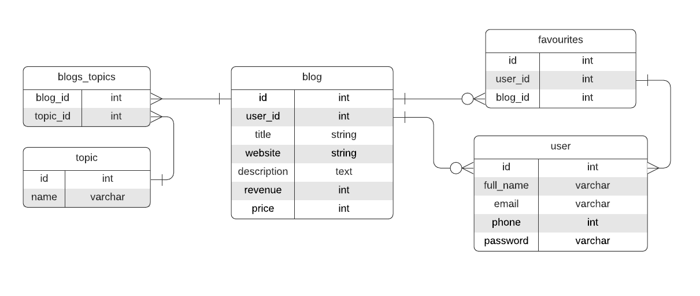
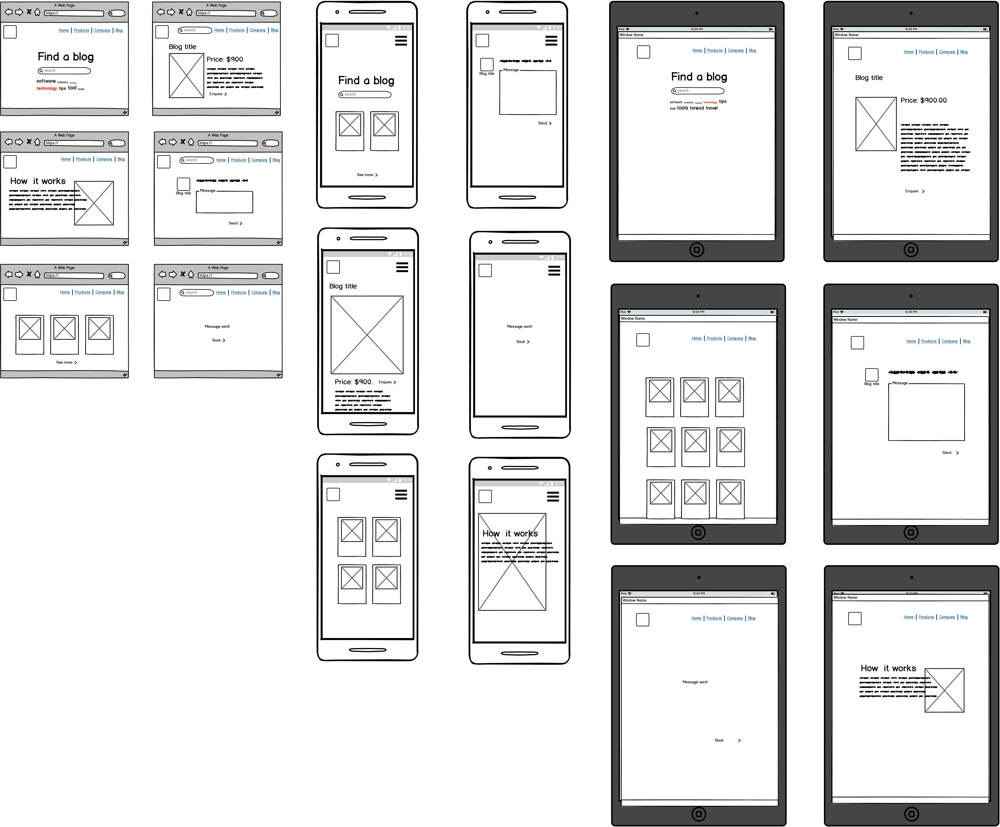

# BlogTrader on Rails

A marketplace to buy and sell niche blogs.

Github: https://github.com/wendycodeworks/blogtrader

Site: https://blogtrader.herokuapp.com/

\- Sitemap
\- Screenshots

## Problem-Solution Fit

Blogging remains popular to individuals and businesses alike. As e-commerce continues to grow, the value of a well-maintained blog cannot be overstated. A successful blog can entice thousands of visitors each month and it's the traffic that often determines the viability of a blog. Since the first blogs emerged, monetization of blogs have developed in complexity. Affiliate sales are one of the most lucrative ways to create an income for individuals. And for businesses, attaching a quality blog to their brand can be a multi-prong benefit; establishing reputation, create leads and engaging customers are all things that can be done with a blog. However, starting a blog from scratch is not always practical and can be difficult. Between producing content, promotion content and monetizing content, it can be daunting for newcomers and expensive for businesses. 

BlogTrader provides a centralised platform to buy and sell monetized blogs. This service is targeted towards solo-entrepreneurs, e-commerce brands and SMEs.  The web-app has been designed to streamline listing creation and payments processing. 

## Application components

**User accounts** - Buyers and sellers are recognised as users on the platform. A user can create and enquire on a listing by creating an account. This is done by signing up through the site, which requires an email and a password.

**Listings** - Blogs are presented as listings on the platform. Listings contain key details about the blog on sale such as domain name, description and monthly revenue. Users can upload a screenshot of their website to help attract a buyer.

**Topic tags** - User have the ability to add tags to their listings. Doing so will help buyers search for their blog by niche and keywords associated with their targeted topic.

BlogTrader is a two-side marketplace web-application. Built with the Ruby on Rails Framework, it applies the MVC - model, view, controller - pattern. 

********** TO BE EXPANDED ************


## Tech stack, APIs and third party services

| Component      | Technology                                    |
| -------------- | --------------------------------------------- |
| **Frontend**   | HTML, SCSS, Bulma Framework                   |
| **Backend**    | Ruby, Rails                                   |
| **Database**   | Postgresql                                    |
| **Deployment** | Heroku                                        |
| **Utilities**  | Amazon S3, Devise, Ransack, Stripe, Ultrahook |
| **Project**    | Git, GitProjects                              |

## Database relations

| Entity      | Relations                                                    |
| ----------- | :----------------------------------------------------------- |
| Blog        | ```belongs_to``` user<br />```has_many``` blogs_topics<br />``has_many`` topics, ``through`` blogs_topics<br / |
| BlogsTopics | ``belongs_to`` blog<br />``belongs_to`` topic                |
| Topic       | ``has_many`` blogs_topics<br />``has_many`` blogs, ``through`` blogs_topics |
| User        | ``has_many`` blogs                                           |

### Database Schema



## User Stories

| Feature        | User   | Story                                                        |
| -------------- | ------ | ------------------------------------------------------------ |
| Listing        | Buyer  | - Wants information on a listing <br />- Wants to enquire on a listing <br />- Wants to search for the listing |
| Listing        | Seller | - Wants to make a listing <br />- Wants to add details about the listing including price <br />- Wants the ability to make edits to the listing <br />- Wants the ability to delete a listing <br />- Wants to receive enquiries about the listing |
| Accounts       | Buyer  | - Wants to keep their listings in one place<br />- Wants a personalised experience<br />- Wants to manage their account settings |
| Accounts       | Seller | - Wants a personalised experience<br />- Wants to store essential information<br />- Wants to manage their account settings |
| Authentication | Buyer  | - Wants security on their account                            |
| Authentication | Seller | - Wants security on their account<br />- Wants protection of their essential information |
| Dashboard      | Buyer  | - Wants to view all their listings<br />- Wants a streamlined management dash to manage their listings |


## Wireframes



## Project Management

The scope of the project was determined prior to commencement of the development. 

The MVP was developed with the Agile methodology. The project started with the essential features:

* CRUD for blog listings
* Image upload capabilities
* Devise

A basic rails application was built within a 3 day sprint. The optional features - such as topic tags and Stripe- were addressed in the following week. 

