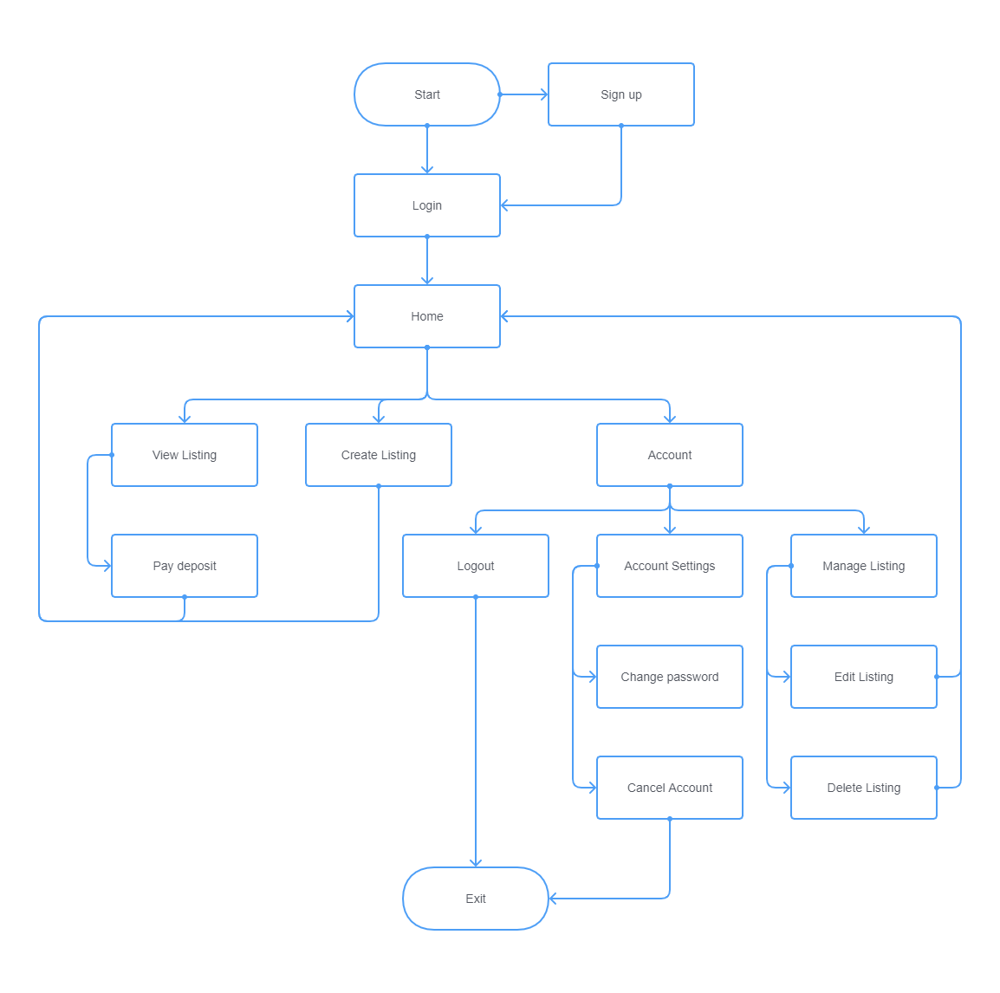
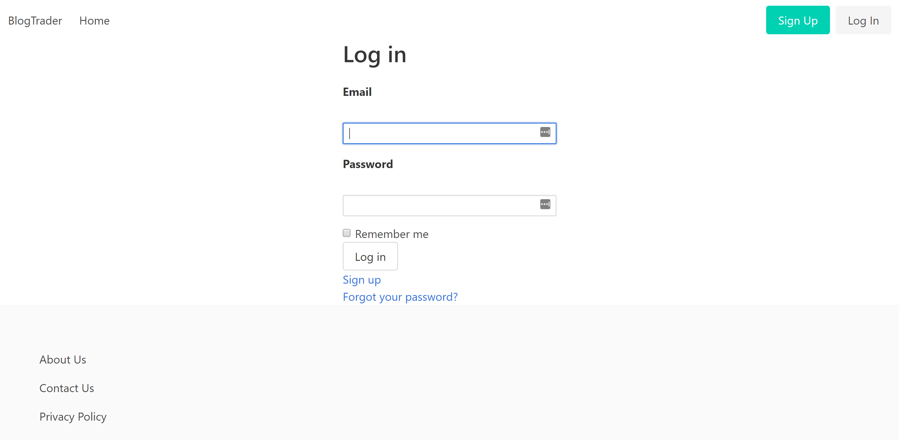
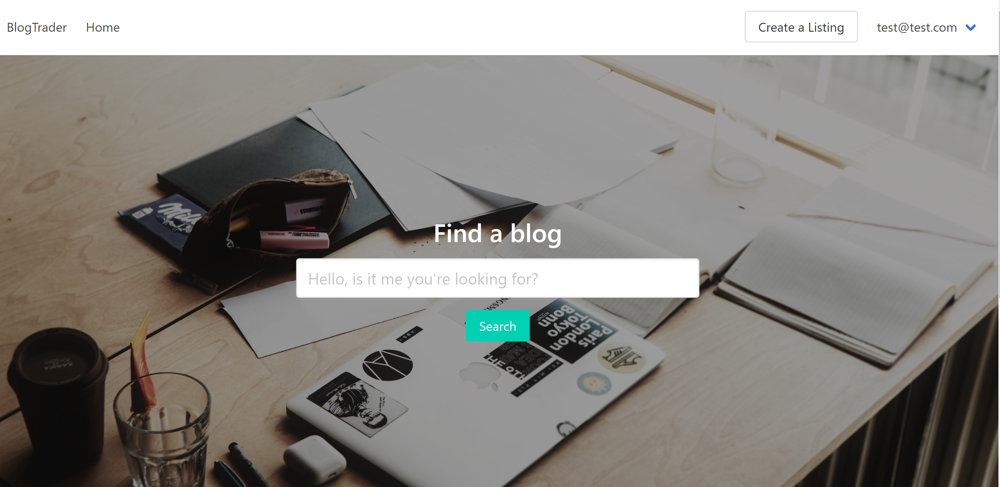
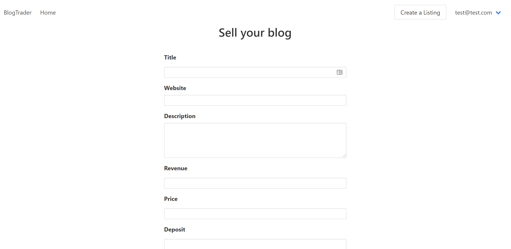
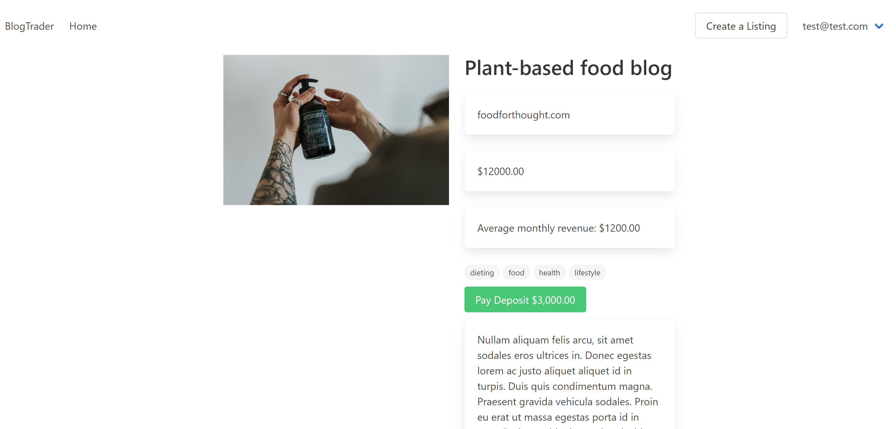
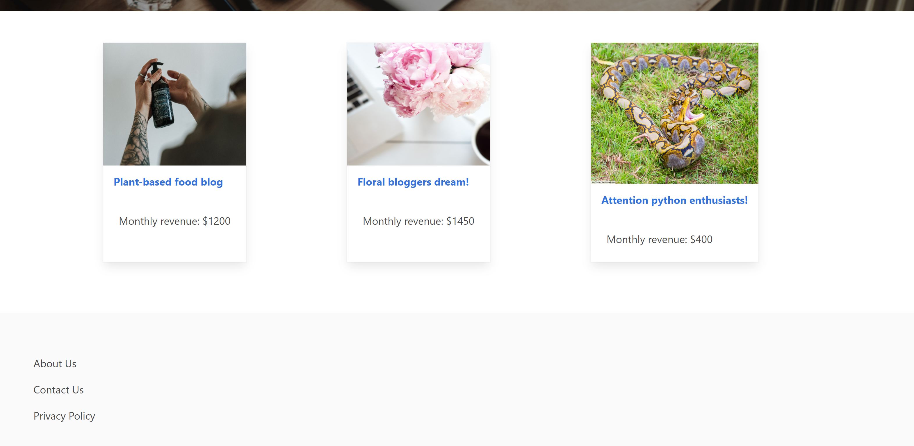
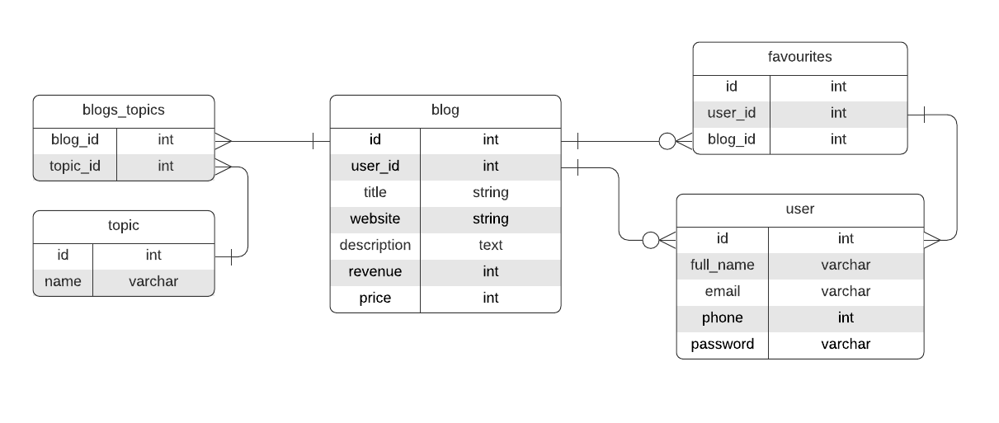

# BlogTrader on Rails

A marketplace to buy and sell niche blogs.

Github: https://github.com/wendycodeworks/blogtrader

Site: https://blogtrader.herokuapp.com/

### Sitemap















## Problem-Solution Fit

Blogging remains popular to individuals and businesses alike. As e-commerce continues to grow, the value of a well-maintained blog cannot be overstated. A successful blog can entice thousands of visitors each month and it's the traffic that often determines the viability of a blog. Since the first blogs emerged, monetization of blogs have developed in complexity. Affiliate sales are one of the most lucrative ways to create an income for individuals. And for businesses, attaching a quality blog to their brand can be a multi-prong benefit; establishing reputation, create leads and engaging customers are all things that can be done with a blog. However, starting a blog from scratch is not always practical and can be difficult. Between producing content, promotion content and monetizing content, it can be daunting for newcomers and expensive for businesses. 

BlogTrader provides a centralised platform to buy and sell monetized blogs. This service is targeted towards solo-entrepreneurs, e-commerce brands and SMEs.  The web-app has been designed to streamline listing creation and payments processing. 

## Application components

**User accounts** - Buyers and sellers are recognised as users on the platform. A user can create and enquire on a listing by creating an account. This is done by signing up through the site, which requires an email and a password.

**Listings** - Blogs are presented as listings on the platform. Listings contain key details about the blog on sale such as domain name, description and monthly revenue. Users can upload a screenshot of their website to help attract a buyer.

**Topic tags** - User have the ability to add tags to their listings. Doing so will help buyers search for their blog by niche and keywords associated with their targeted topic.

BlogTrader is a two-side marketplace web-application. Built with the Ruby on Rails Framework, it applies the MVC - model, view, controller - pattern. Compartmentalising each aspect of the development process addresses issues of separability and allows for integration of future features.

When a user first encounters BlogTrader they will be prompted to create an account. This is facilitated by the Devise gem, and from there the user can participate in the marketplace as a buyer or a seller. As a seller, the user can create, view, edit and delete their listing. A listing is recognised as a blog entity, and all fields require an input. For buyers, they are free to browse the listings if they have an active account with BlogTrader. 

A complete and thorough listing serves well to entice interest and buyers can make a deposit on a listing. When the buyer initiates the transaction - by clicking the button - the buyer is then redirected to the Stripe site to be securely processed. And with the use of the webhooks, when the buyer is redirected back to BlogTrader they will receive an onscreen confirmation of the deposit.

Topic tags are a key feature on listings and are associated through a many-to-many relationship with a blog. Each tag represents a subject or theme of a blog, and in future releases, will help identify a listing in a search. Blogs_topics provides the scope, and all the associated topic tags are displayed on the listing. 

Listings can be edited and delete in one central location: manage listing. This can be found in the accounts tab, conveniently located on the top right hand corner of the navbar. The current user ID is used to display only the listings that have been created by that user; this prevents unauthorised access to listings by buyers or other sellers. 


## Tech stack, APIs and third party services

| Component      | Technology                                    |
| -------------- | --------------------------------------------- |
| **Frontend**   | HTML, SCSS, Bulma Framework                   |
| **Backend**    | Ruby, Rails                                   |
| **Database**   | Postgresql                                    |
| **Deployment** | Heroku                                        |
| **Utilities**  | Amazon S3, Devise, Ransack, Stripe, Ultrahook |
| **Project**    | Git, GitProjects                              |

## Database relations

| Entity      | Relations                                                    |
| ----------- | :----------------------------------------------------------- |
| Blog        | ```belongs_to``` user<br />```has_many``` blogs_topics<br />``has_many`` topics, ``through`` blogs_topics<br / |
| BlogsTopics | ``belongs_to`` blog<br />``belongs_to`` topic                |
| Topic       | ``has_many`` blogs_topics<br />``has_many`` blogs, ``through`` blogs_topics |
| User        | ``has_many`` blogs                                           |

### Database Schema



## User Stories

| Feature        | User   | Story                                                        |
| -------------- | ------ | ------------------------------------------------------------ |
| Listing        | Buyer  | - Wants information on a listing <br />- Wants to enquire on a listing <br />- Wants to search for the listing |
| Listing        | Seller | - Wants to make a listing <br />- Wants to add details about the listing including price <br />- Wants the ability to make edits to the listing <br />- Wants the ability to delete a listing <br />- Wants to receive enquiries about the listing |
| Accounts       | Buyer  | - Wants to keep their listings in one place<br />- Wants a personalised experience<br />- Wants to manage their account settings |
| Accounts       | Seller | - Wants a personalised experience<br />- Wants to store essential information<br />- Wants to manage their account settings |
| Authentication | Buyer  | - Wants security on their account                            |
| Authentication | Seller | - Wants security on their account<br />- Wants protection of their essential information |
| Dashboard      | Buyer  | - Wants to view all their listings<br />- Wants a streamlined management dash to manage their listings |


## Wireframes


## Project Management

The scope of the project was determined prior to commencement of the development. After completing research and drafting wireframes, each application component was broken into tasks with checklists for smaller aspects of each task. 

The MVP was developed with the Agile methodology. The project started with the essential features:

* CRUD for blog listings
* Image upload capabilities
* Devise

A basic rails application was built within a 3 day sprint. The optional features - such as topic tags and Stripe - were addressed in the following week. 

